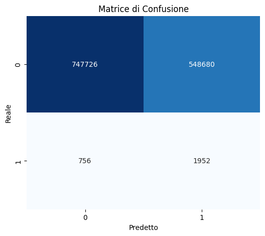
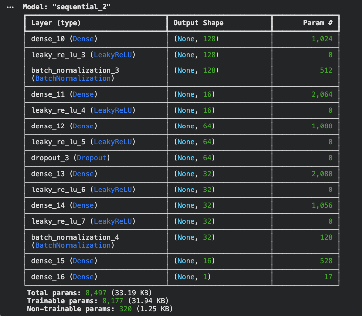

# Risk Evaluation

__Risk Evaluation__ is the second main feature of WEDS.

## Overview

The idea is to compute a _Risk Score_ that will characterize nodes' sampling frequency.

### Assumptions

The idea will work thanks to two assumptions:

1. An higher _Risk Score_ implies that a wildfire is more likely to happen.
2. Where a wildfire is more likely to start the node should sample more frequently.

This two naive assumptions are enough to define the goal and how to accomplish it.

### Goal

The main goal of _Risk Evaluation_ task can be defined as:

    "The computed Risk should be directly proportional to the probability that a Wildfire will start in order to minimize the occurence of false negatives with respect to energy consumption by optimizing the sampling frequency."

## Process

The task will follow some simple main steps, assuming the model is already installed:

1. Measure environmental data.
2. Normalize and clean data.
3. Compute the _Risk Score_ using the model.
4. Adapt _Sampling Frequency_ with respect to the _Risk Score_.

### Environmental Clean Data

Data will be measured and then normalized and cleansed.
We expect stable data due to the fact that humidity and temperature changes very slowly over the day.

### Compute

The score will be directly computed by the model.

### Adapt

This will be the thoughest part, there are two main problems:

1. Should there be a threshold whenever the risk is too low?
2. How is _Risk Score_ connected to the probability of starting wildfires?

__(1)__ There is always a probability that a wildfire is not started only by natural causes but by human intervation even if conditions are not favourable. How much should the system be able to detect this scenario? placing a threshold will imply more consumption when not needed just to detect a very rare event.

__(2)__ What is the connection between the two parameters? Should it be the ratio between number of wildfire started and not within certain conditions? Or something else?

## Dataset

//TODO

## LOGS

### V1

    Confusion Matrix:
                precision    recall  f1-score   support

            0       1.00      0.58      0.73   1296406
            1       0.00      0.72      0.01      2708

        accuracy                           0.58   1299114
    macro avg       0.50      0.65      0.37   1299114
    weighted avg       1.00      0.58      0.73   1299114

### V2

    Confusion Matrix:
                precision    recall  f1-score   support

            0       1.00      0.61      0.75   1296406
            1       0.00      0.69      0.01      2708

        accuracy                           0.61   1299114
    macro avg       0.50      0.65      0.38   1299114
    weighted avg       1.00      0.61      0.75   1299114

The model result as "too stupid" to learn complex patterns.

### V3

Model architecture was enhanced in depth.

### V4

## Features

To compute the risk score are used the following features:

- __Temperature__
- __Pressure__
- __Humidity__
- __Average Temperature__
- __Delta Temperature__
- __Average Humidity__
- __Delta Humidity__
- __Wind Speed__
- __Wind Dry Factor__: The relation between wind and humidity.

## First Results

Whether these results are "good" depends on how you define success, but for an anomaly detection task with a 0.21% baseline, these are actually very realistic and solid results. Here is how to properly interpret what these numbers are telling you.

1. The "Multiplier" Perspective (Why these results are good)
You must compare the model's true probabilities against your dataset's historical baseline (average risk), which is 0.21%.

Look at what your model is achieving at the extremes:

Score 0.06 -> 0.01% True Prob: The model successfully identifies ultra-safe conditions where a fire is 21 times less likely to happen than normal.

Score 0.55 -> 0.23% True Prob: This is your "Average Day." When the model says ~0.5, the risk is exactly aligned with your historical background average.

Score 0.94 -> 3.74% True Prob: This is a massive spike. When the model outputs a score >0.9, the environment is 18 times more likely to catch fire than on an average day.

From a predictive standpoint, a model that can reliably isolate conditions that are 18x more dangerous than the baseline is a highly effective early warning system.

2. The Absolute Perspective (Why it never reaches 50%)
You might be disappointed that your highest score (0.94) only translates to a 3.74% real-world chance of fire, instead of 94% or 50%. This is not a failure of the model; it is a reality of the physical world.

Weather vs. Ignition: Your model uses weather data (temperature, humidity, wind). Even if the weather is perfect for a wildfire (Score 0.99), a fire does not spontaneously materialize out of thin air. An ignition source (lightning, a discarded cigarette, a spark from a machine) is still required.

Because ignition is a random, rare event, the absolute mathematical probability of a fire starting in a specific area at a specific time remains low, even on the hottest, driest day of the year.

How to use this in Production
Since you now have this empirical mapping, you should abandon the idea of looking for a 50% probability. Instead, configure your drone or dashboard alerts based on the "Risk Multiplier":

LOW RISK (Green): Model Score 0.0 to 0.35 (Risk is below average).

MODERATE RISK (Yellow): Model Score 0.35 to 0.65 (Risk is around the 0.21% average).

HIGH RISK (Orange): Model Score 0.65 to 0.85 (Risk is 2x to 4x higher than average).

CRITICAL RISK (Red): Model Score > 0.85 (Risk is 5x to 18x+ higher than average. Dispatch drones for active monitoring).

Final Verdict: Yes, the model is good. It has successfully separated the "safe" weather patterns from the "dangerous" ones. You do not need to recalibrate it; you just need to update your threshold logic to trigger alerts when the score crosses 0.75 or 0.82.
