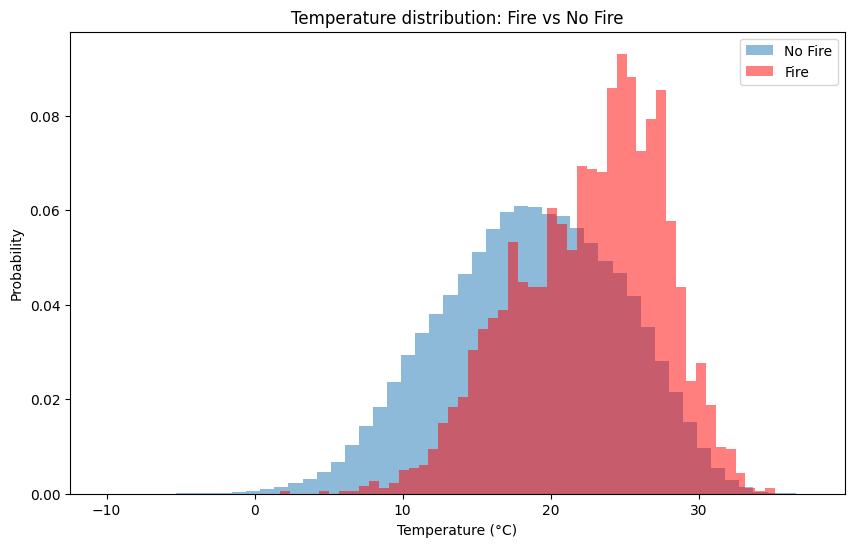
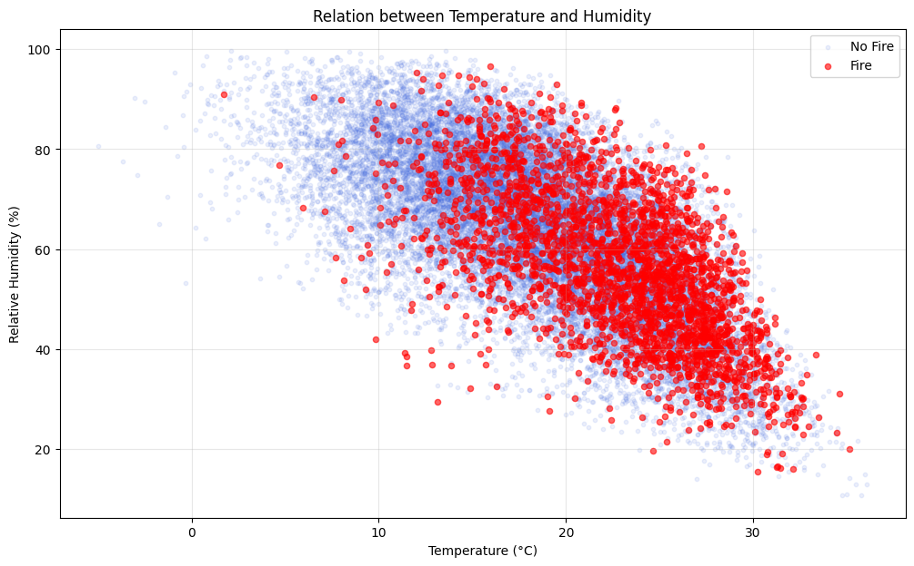
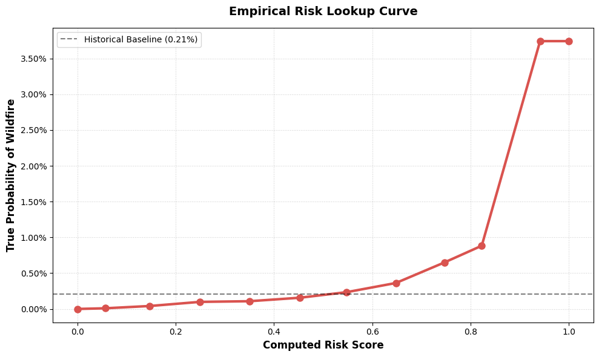
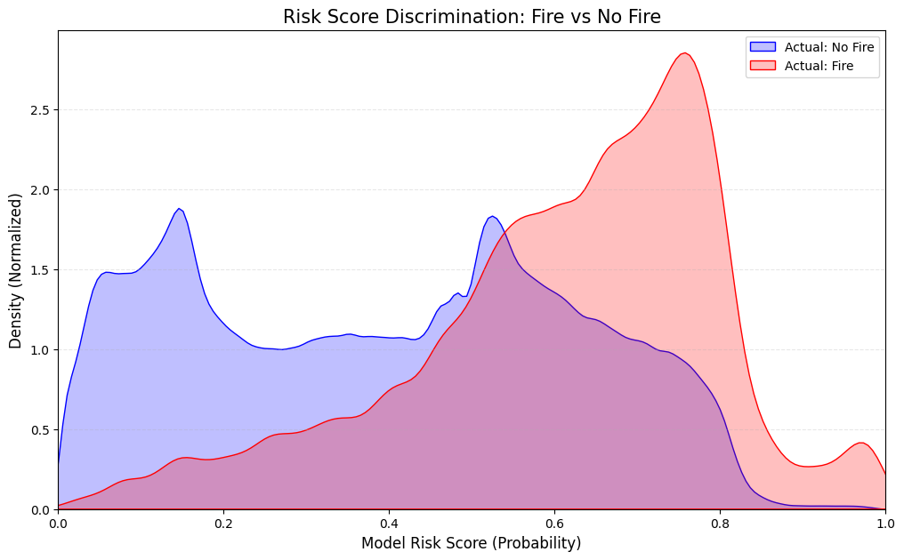

---
aliases:
  - Risk Score
  - RiskScore
  - risk score
tags:
  - WEDS
---
# Risk Score Computation

## The Dataset

We used two different ___Datasets___:

- [ERA5](https://cds.climate.copernicus.eu/datasets/reanalysis-era5-single-levels?tab=overview) - Hourly estimation of athmosferic quantities (and others).
- [CAMS](https://ads.atmosphere.copernicus.eu/datasets/cams-global-fire-emissions-gfas?tab=overview) - Global biomass burning emission based on Fire Radiative Power.

Both ___Datasets___ are available online for free and are part of the __Copernicus__ european project.

### Dataset Features

From the dataset we have extrapolated different raw features:

- [ERA5](https://cds.climate.copernicus.eu/datasets/reanalysis-era5-single-levels?tab=overview):
	- __t2m__ - Temperature.
	- __d2m__ - Dewpoint temperature.
	- __sp__ - Surface Pressure.
- [CAMS](https://ads.atmosphere.copernicus.eu/datasets/cams-global-fire-emissions-gfas?tab=overview):
	- __frpfire__ - Fire Radiating Power.

This features are then used to derive the different features that will be used by the model to compute the _Risk Score_:

- __Temperature__ _(Celsius)_
- __Relative Humidity__ _(Percentage)_
- __Pressure__ _(Pascal)_
- __Average Weekly Temperature__
- __Average Weekly Relative Humidity__
- __Temperature Delta__
- __Relative Humidity Delta__

### The Target

The target is then defined as: $$\text{target} = \left \{ \begin{array}{cl} 
1 & :\ \text{frp} \ge 10^{-9} \\
0 & :\ \text{o.w.}\end{array}\right.$$ 
This will let us discriminate wether there is a fire or not.

### Dataset Imbalance

The ___Dataset___ was extremely imbalanced with:

- $0.21\%$ of $1$.
- $99.79\%$ of 0.

This made _Data Normalization_ a foundamental step for the project.

## How It Works

The idea behind how the model is trained is very simple:

>[!IMPORTANT] Idea
>Whenever there was a fire there was most likely favourable conditions for a fire to start. Furthermore if we train the model to predict a fire we are intrinsically training the model to catch this _favourable conditions_.
>In the end the _score_ that the model will compute is directly proportional on how much the conditions are _favourable_ to start a wildfire.

This idea can also be visualized by analyzing the ___Dataset___, in particular the correlation between fires, temperature and humidity.

### Results

Looking at the __Confusion Matrix__ is quite useless in this project because a wildfire is ==very little likely to start by natural causes== but it is often characterized by human work.

What was interesting to see was that the model had successfully caught the relation between a _wildfire_ and the _conditions_ for this il most likely to start. This can be seen by mapping the _computed score_ to the __True Probability of Fire__.

> [!NOTE] True Probability of Fire
> It is mathematically defined as: $$P(\text{Actual Fire}\ |\ \text{Model Risk Score} \in [x_1, x_2]) = \frac{\text{Actual Fires with score}\in [x_1, x_2]}{\text{Total Observations with score}\in [x_1, x_2]}$$

We can compute it and obtain the graph:

As we can see we may distinguish three different tresholds.

- $\text{risk score} < 0.35$ with fire probability $< 0.12\%$
- $0.35 < \text{risk score} < 0.83$ with fire probability $< 0.79\%$
- $\text{risk score} > 0.83$ with fire probability $\le 3.08\%$

This three threshold will define the adaptive duty cycle.

Finally we can state that obtaining a _maximal prediction_ of $3.04\%$ starting from a ___baseline___ of $0.21\%$ is a huge result.

Furthermore the three thresholds represents the __Risk__ differences perfectly, with a ratio of $\simeq 7\! \times$ between __Low Risk__ and __Medium Risk__ and $\simeq 3\! \times$ between __Medium Risk__ and __High Risk__.
